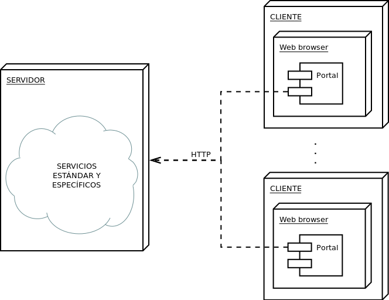
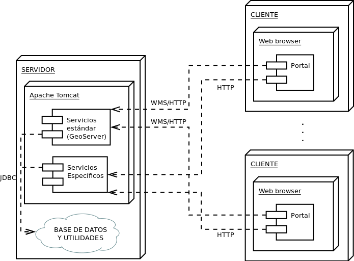

Arquitectura
==============

La arquitectura del sistema sigue un patrón cliente/servidor típico. La interacción comienza con el cliente
conectando a través el navegador web al servidor HTTP y descargando la aplicación del portal, que se ejecuta
dentro de dicho navegador.

Servicios
----------

Servicios específicos
....................... 

