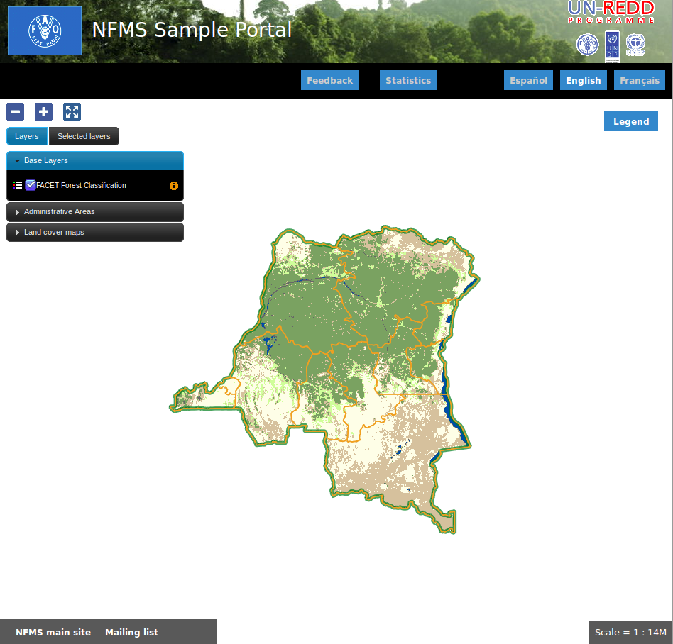

Portal: Configuración inicial 
======================================

El Portal de NFMS es la aplicación pública de la plataforma, utilizada para la visualización de los recursos cartográficos y estadísticos.

El portal es personalizable a las necesidades de cada país, tanto en su aspecto como en los datos mostrados. La aplicación viene con una 
configuración por defecto que puede usarse como punto de partida.

En nuestro caso, una vez instalado el portal se obtendrá el siguiente aspecto inicial:

El Portal es accesible en:

  http://localhost/portal/

El directorio de configuración
------------------------------

La estructura del directorio de configuración (:file:`/var/portal`) tiene la siguiente estructura::

	  /var/portal
	    |- portal.properties
	    |- layers.json
	    |- header.tpl
	    |- footer.tpl
	    |- messages/...
	    \- static/
	        |- unredd.css
	        |- custom.js
	        |- img/...
	        \- loc/
	            |- en/
	            │   |- documents/...
	            │   |- html/...
	            │   \- images...
	            \- es
	                |- documents/...
	                |- html/...
	                \- images/...

Los ficheros principales son:

 * ``portal.properties``, contiene parámetros generales de conexión, y define los idiomas soportados.
 * ``layers.json``, probablemente el fichero más importante, contiene la configuración de las capas de datos a mostrar.
 * ``headers.tpl`` y ``footer.tpl``, plantillas para configurar la cabecera y el pie de la página.
 * ``messages/`` contiene los textos de la aplicación traducidos a varios idiomas.
 * ``static/`` contiene el resto de recursos: estilos css, código javascript personalizado, y otros recursos estáticos como documentos o imágenes. 

Adaptación del aspecto gráfico
------------------------------

Cabecera y pie de página
........................

Los elementos de la cabecera están descritos en ``header.tpl``, en formato HTML. Es posible añadir contenido
a la cabecera añadiendo elementos *div* y *a* dentro del elemento ``
``:

.. code-block:: html

  
  
  

Los dos primeros logos enlazan a las respectivas webs. El atributo ``id`` será utilizado desde la hoja de estilos ``unredd.css``,
donde se asociará una imagen y otros parámetros de visualización. Como ejercicio:

 * Abrir el fichero ``custom.css`` y buscar los elementos "infona_logo", "seam_logo" y "fapi_logo".

.. note:: `Tutorial de CSS <http://www.csstutorial.net/>`_

La plantilla para el pie de página ``footer.tpl`` funciona de igual modo. En este caso, podemos añadir algunos enlaces de interés
al portal bajo el elemento ``
``:

.. code-block:: html

  <a id="satisfaction_survey_link" href="${survey_url}" target="_blank">${satisfaction_survey}</a>
  <a id="user-group" href="http://groups.google.com/group/nfms4redd-users" target="_blank">${nfms_mailing_list}</a>

Aquí vemos algunos elementos del estilo ``${...}``, como ``${survey_url}``, ``${satisfaction_survey}`` y ``${nfms_mailing_list}``.
Estos elementos de la plantilla serán sustituidos por mensajes de texto traducidos a cada idioma.

Como ejercicio:

  * Buscar los elementos `survey_url`, `satisfaction_survey` y `nfms_mailing_list` en ``messages_es.properties``.

Para aplicar los cambios, hace falta reiniciar de nuevo la aplicación::

	$ sudo service diss_geoserver restart

Soporte multiidioma
-------------------

En el directorio ``messages`` contamos con un fichero ``messages.properties`` que contiene los mensajes por defecto. Son los 
textos que se usarán en caso de no encontrar mensajes traducidos a una lengua específica. Los ficheros con los mensajes 
traducidos llevan el código del idioma al final del nombre, según la `nomenclatura ISO 639-1 de dos
letras <http://en.wikipedia.org/wiki/List_of_ISO_639-1_codes>`_.

Para añadir un nuevo idioma (por ejemplo, el guaraní):

 * Editar ``portal.properties`` y añadir el elemento ``"gn": "Guaraní"`` a la propiedad ``languages``::

    languages = {"gn": "Guaraní", "es": "Español", "en": "English"}

 * Copiar el fichero ``messages_es.properties`` con el nuevo nombre ``messages_gn.properties``.
 * Traducir los textos en ``messages_gn.properties``.
 * Reiniciar la aplicación para aplicar los cambios. Desde la linea de comandos::

	sudo service diss_geoserver restart

Configuración de una nueva capa
-------------------------------

La definición de las capas a mostrar en el Portal se encuentra en el fichero ``layers.json``.

Contiene la información para asociar los elementos de la interfaz de usuario (panel con la lista de capas en la parte izquierda de la página)
con las capas WMS publicadas en GeoServer, personalizar las leyendas, y definir cuáles de las capas son interrogables. También clasifica las capas
por grupos.

El formato utilizado para este fichero de configuración es JSON.

.. note:: Recursos JSON

  * `Introducción al formato JSON <http://www.json.org/>`_
  * `Validador de JSON <http://jsonformatter.curiousconcept.com/>`_

El fichero ``layers.json`` contiene tres secciones:

* ``layers``
* ``contexts``
* ``contextGroups``

En este apartado vamos a realizar dos ejercicios:

* En primer lugar, vamos a añadir la capa de límites administrativos al grupo existente de "admin_areas".

* En segundo lugar, añadiremos la capa "roads" en un nuevo grupo de capas.

Layers
......

Cada "layer" se corresponde con una de las capas publicadas en GeoServer, y describe la manera de conectarse al servidor para obtener los datos:

.. code-block:: js

  "layers": [
     {
      "id": "limites_administrativos",
      "baseUrl": "http://172.16.250.131/diss_geoserver/gwc/service/wms",
      "wmsName": "capacitacion:limites_administrativos",
      "imageFormat": "image/png",
      "visible": true
    }
  ],

* Es posible copiar y pegar un elemento existente y reemplazar :

  * el nuevo "id" será distinto a todos los otros, por ejemplo: "limites_administrativos".
  * el nuevo "wmsName" será "capacitacion:limites_administrativos" (el nombre de la capa publicada en GeoServer).
  * la baseUrl debe apuntar al servidor geoserver donde hemos cargado la capa.

Contexts
........

Cada "context" complementa la información definida en "layers" añadiendo nuevos datos necesarios para
mostrar la información en la interfaz gráfica.

.. code-block:: js

  "contexts": [
    {
      "id": "limites_administrativos",
      "active": true,
      "label": "${limites_administrativos}",
      "infoFile": "limites_def.html",
      "layers": ["country"],
      "inlineLegendUrl": "http://172.16.250.131/diss_geoserver/wms?REQUEST=GetLegendGraphic&VERSION=1.0.0&FORMAT=image/png&WIDTH=20&HEIGHT=20&LAYER=unredd:country&TRANSPARENT=true"
    }
  ],

* Añadir un nuevo objeto en "context", de igual estructura y valores que "country", excepto los siguientes cambios:

  * el nuevo "id" será "regions".
  * como "label" se utilizará "${limites_administrativos}". De nuevo, esta etiqueta de sintaxis ${...} será sustituida por un texto en el idioma que
    corresponda, según los contenidos de "messages". Es la etiqueta que se mostrará en la interfaz gráfica.
  * en "infoFile" pondremos "administrative_boundaries_def.html". Esto creará un enlace a un documento con información sobre 
    los datos (localizado en :file:`static/loc/<idioma>/html/`).
  * en "layers" pondremos ["limites_administrativos"], haciendo referencia al nuevo *layer*.
  * en "inlineLegendUrl" estableceremos el parámetro LAYER así `LAYER=capacitacion:limites_administrativos`. Esto generará
    una imagen con la leyenda. 

ContextGroups
.............

Los "contextGroups" son una estructura recursiva (multinivel) para agrupar visualmente las capas en el panel.
El "group" de primer nivel construye cada uno de los grupos de capas en forma de persiana desplegable, conteniendo una lista de 
"items" que hacen referencia a los contextos definidos anteriormente.

.. code-block:: js
     
  "contextGroups": 
  {
    "items": [
      {
        "group": {
          "label": "${admin_areas}",
          "items": [
            { "context": "country" }
          ]
        }
      }
    ]
  }

* Añadir un nuevo elemento `{ "context": "limites_administrativos" }` a continuación de `{ "context": "country" }`. Esto incluirá la capa
  en el grupo de áreas administrativas.
  
* Finalmente, utilizar un validador JSON, para comprobar que la sintaxis del nuevo :file:`layers.json` es correcta, y recargar la página.

Posición inicial del mapa y prefijo capas
------------------------------------------

Antes de añadir la capa de carreteras vamos a proceder a configurar la posición inicial del mapa. Para ello tenemos que editar el fichero
``static/custom.js`` y que contiene al principio del todo una declaración con los valores que nos interesa cambiar::

	UNREDD.maxExtent = new OpenLayers.Bounds(-20037508, -20037508, 20037508, 20037508);
	UNREDD.restrictedExtent = new OpenLayers.Bounds(-20037508, -20037508, 20037508, 20037508);
	UNREDD.maxResolution = 4891.969809375;
	UNREDD.mapCenter = new OpenLayers.LonLat(-9334782,-101119);
	UNREDD.defaultZoomLevel = 0;
	
	UNREDD.wmsServers = [
	    "http://demo1.geo-solutions.it",
	    "http://incuweb84-33-51-16.serverclienti.com"
	];
	
Para la posición central del mapa tendremos que modificar el valor *UNREDD.mapCenter* y poner la coordenada central en Google 
Mercator (EPSG:900913 or EPSG:3857), que es el sistema de referencia que se usa en la aplicación web.

  * Obtener la coordenada central del mapa en el sistema de coordenadas usado en el portal.

Para regular el nivel de zoom inicial es posible cambiar el valor *UNREDD.defaultZoomLevel*. Cuanto mayor es el nivel de
zoom, más cercano es el zoom inicial.

Por último, podemos observar en el punto anterior cómo el fichero ``layers.json`` contiene *layers* con un valor
de *baseUrl* que comienza por el carácter "/" y no especifican servidor. Estas URLs se componen prefijando los servidores
especificados en el valor *UNREDD.wmsServers*.

Ejercicio:

  * Poner el servidor local en *UNREDD.wmsServers* y eliminar todas las capas que no están en dicho servidor.

Configuración de un nuevo grupo de capas
----------------------------------------

Repetiremos el ejercicio anterior para añadir la capa de ciudades, teniendo en cuenta que:

* Para el nuevo "layer", usaremos el id "ciudades" y la capa wms "capacitacion:ciudades". Además, añadiremos un nuevo
  atributo `"legend": "ciudades.png"` para mostrar la leyenda de la capa. Este atributo hace referencia a una imagen
  localizada en :file:`static/loc/<idioma>/images/`.
  
* En el nuevo "context", será más sencillo, sólo contendrá los tres elementos `"id": "roads", "label": "${ciudades}", "layers": ["ciudades"]`.

* En "contextGroups", crearemos un nuevo grupo llamado "otros", con esta sintaxis:

.. code-block:: js

  {
    "group": {
      "label": "${other}",
      "items": [
          { "context": "roads" }
      ]
  }

* Tras validar el JSON, y recargar la página, obtendremos la capa de carreteras bajo el nuevo grupo "Otros".

Tras realizar los ejercicios, el contenido final de `layers.json` será:

.. code-block:: js

	{
	  "layers": [
	    {
	      "id": "limites_administrativos",
	      "baseUrl": "/diss_geoserver/gwc/service/wms",
	      "wmsName": "capacitacion:limites_administrativos",
	      "imageFormat": "image/png",
	      "visible": true
	    },{
	      "id": "ciudades",
	      "baseUrl": "/diss_geoserver/gwc/service/wms",
	      "wmsName": "capacitacion:ciudades",
	      "imageFormat": "image/png",
	      "visible": true
	    },{
	      "id": "carreteras",
	      "baseUrl": "/diss_geoserver/gwc/service/wms",
	      "wmsName": "capacitacion:carreteras",
	      "imageFormat": "image/png",
	      "visible": true
	    }
	  ],
	
	  "contexts": [
	    {
	      "id": "ciudades",
	      "label": "${ciudades}",
	      "layers": ["ciudades"],
	      "inlineLegendUrl": "/diss_geoserver/wms?REQUEST=GetLegendGraphic&VERSION=1.0.0&FORMAT=image/png&WIDTH=20&HEIGHT=20&LAYER=capacitacion:ciudades&TRANSPARENT=true"
	    },{
	      "id": "carreteras",
	      "active": true,
	      "label": "${carreteras}",
	      "layers": ["carreteras"],
	      "inlineLegendUrl": "/diss_geoserver/wms?REQUEST=GetLegendGraphic&VERSION=1.0.0&FORMAT=image/png&WIDTH=20&HEIGHT=20&LAYER=capacitacion:carreteras&TRANSPARENT=true"
	    },{
	      "id": "limites_administrativos",
	      "active": true,
	      "infoFile": "limites_def.html",
	      "label": "${limites_administrativos}",
	      "layers": ["limites_administrativos"],
	      "inlineLegendUrl": "/diss_geoserver/wms?REQUEST=GetLegendGraphic&VERSION=1.0.0&FORMAT=image/png&WIDTH=20&HEIGHT=20&LAYER=capacitacion:limites_administrativos&TRANSPARENT=true"
	    }
	  ],
	
	  "contextGroups":
	  {
	    "items": [
	      {
	        "group": {
	          "label": "${base_layers}",
	          "items": [
	            { "context": "carreteras" }
	          ]
	        }
	      },
	      {
	        "group": {
	          "label": "${admin_areas}",
	          "items": [
	            { "context": "limites_administrativos" }
	          ]
	        }
	      },
	      {
	        "group": {
	          "label": "${land_cover_maps}",
	          "items": [
	          ]
	        }
	      },
	      {
	        "group": {
	          "label": "${other}",
	          "items": [
	            { "context": "ciudades" }
	          ]
	        }
	      }
	    ]
	  }
	}